  

### `> whoami`

I'm **Jishan Mulla**, a **DevOps Engineer** working across cloud and on-prem infrastructure. I build repeatable delivery workflows, operate Kubernetes clusters, and turn troubleshooting into practical automation.

**AWS · Kubernetes · Docker · Terraform · GitHub Actions · Flux CD · Prometheus · Grafana · Loki · Linux**

  

### `> current_focus`

| Build | Operate | Improve |
| :--- | :--- | :--- |
| CI/CD and GitOps workflows | Cloud and on-prem Kubernetes | Reusable infrastructure automation |
| Repeatable release processes | Metrics, logs and troubleshooting | Clear runbooks and recovery procedures |

  

### `> explore`

[Repositories](https://github.com/JISHAN-HI?tab=repositories) · [GitHub activity](https://github.com/JISHAN-HI?tab=overview)

Built with Python and self-contained SVGs. Workflow animation is illustrative; contribution activity uses real public GitHub data.
